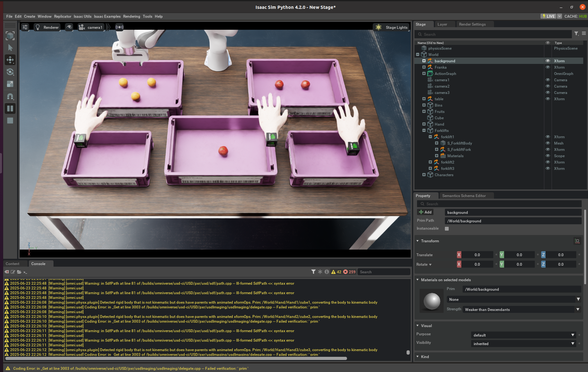
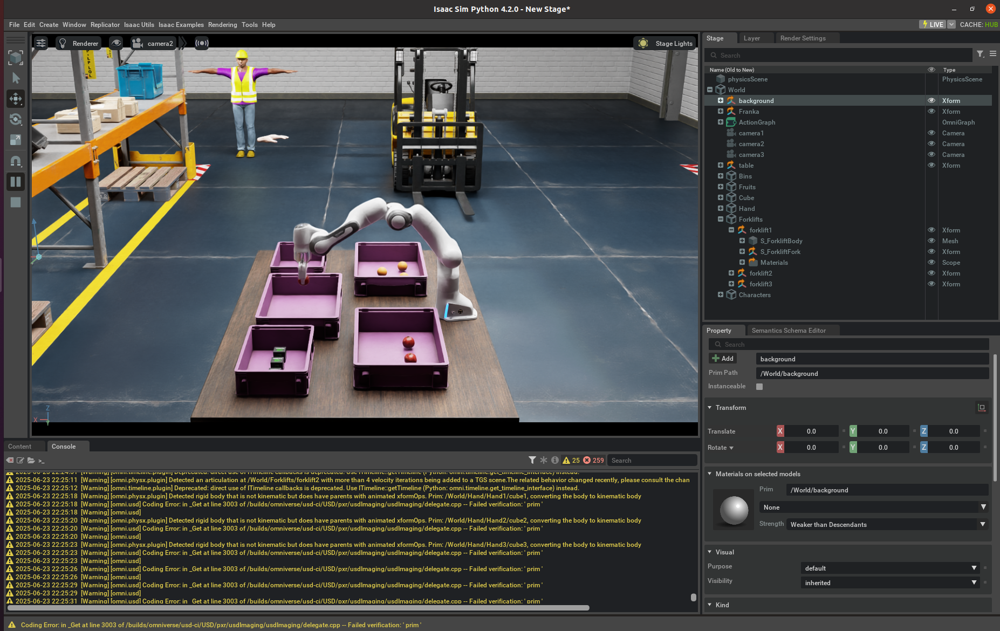
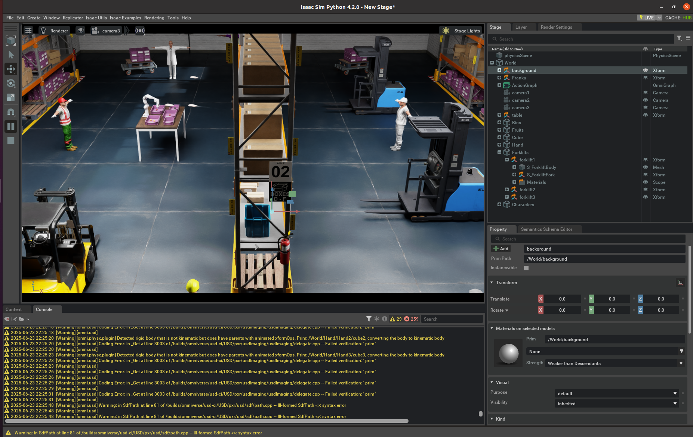
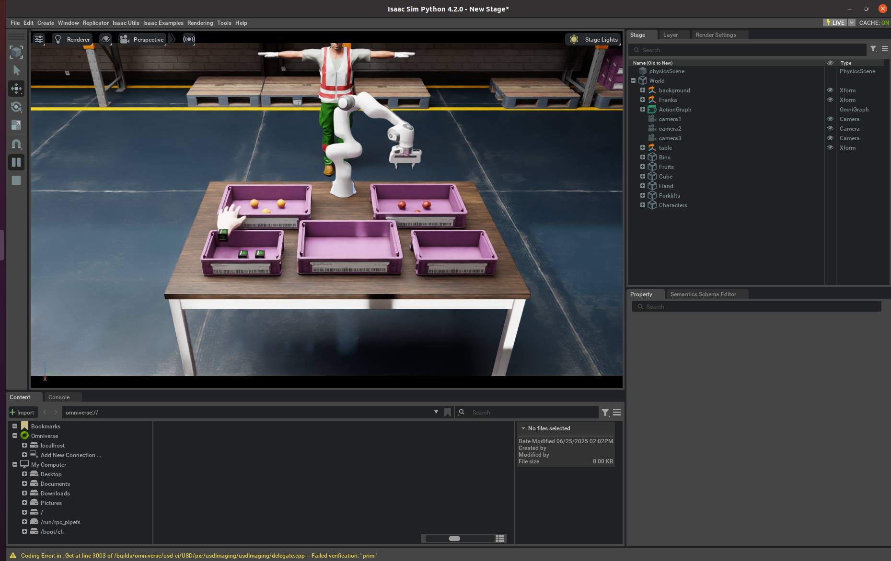

# 🧠 Online Dynamic Risk Assessment for Human-Robot Interaction

## 📑 Table of Contents

- [ℹ️ About](#-about)
- [🧪 Test Environment](#-test-environment)  
- [⚙️ Requirements](#️-requirements) 
- [🛠️ Installation](#️-installation)  
- [🚀 How to Run](#-how-to-run)  
- [🎥 Visualisation](#-visualisation) 
- [📂 Related Branches](#-related-branches)

## ℹ️ About

This project is implemented in Isaac Sim and simulates a human-robot collaborative setup, where both a human and a Franka robot perform pick-and-place tasks in an industrial environment.

- The Franka robot picks and places pomegranates and oranges.  
- The human hand picks and places cubes.

- The camera1 video feed is published, and MediaPipe tracking is overlaid on that feed. A graph is constructed with the robot as the top node, intermediate nodes representing left, right, and center regions, and the hands as child nodes attached to these regions if detected by MediaPipe in the frame.  
- Based on a risk metric, the likelihood of collision between the hands and the robot is dynamically calculated and updated on the graph.

## 🧪 Test Environment

- Isaac Sim version 4.5.0 or 4.2.0  
- ROS Noetic  
- Ubuntu 20.04  
- Python 3.10  


## ⚙️ Requirements

### System

- **Ubuntu 20.04 / 22.04** (tested on 20.04)  
- Windows supported only for GUI; Docker support is Linux-only

### Hardware (Minimum)

| Component | Specs                         |
|-----------|-------------------------------|
| CPU       | Intel i7 (7th Gen) / Ryzen 5  |
| RAM       | 32 GB                         |
| Storage   | 50 GB SSD                     |
| GPU       | RTX 3070 (8 GB VRAM, with RT Cores) |

> GPUs **must** have RT cores (e.g., RTX series). A100/H100 not supported.

### Drivers

| Platform | Recommended Version          |
|----------|-----------------------------|
| Linux    | 535.129.03 or newer         |
| Windows  | 537.58 or 537.70            |

> For Ubuntu 22.04.5 with kernel 6.8.0+, use driver version 535.216.01 or newer.

## 🛠️ Installation

### Install Python Dependencies

Clone the repo and install required packages:

```bash
# Clone the repository
git clone https://github.com/Rsjaigk/nvidia_omniverse_franka.git
cd nvidia_omniverse_franka/src/franka_pick_and_place/src

# Install the requirements
pip install -r requirements.txt
```

### Additional Setup Instructions

1. Install [ROS1 Noetic](https://wiki.ros.org/noetic/Installation/Ubuntu)
2. Install [Visual Studio Code](https://code.visualstudio.com/download)
3. For Isaac Sim installation, follow the appropriate guide based on your version: 
    - For Isaac Sim 4.2.0, see the [Isaac Sim 4.2.0 Workstation Installation Guide](https://docs.isaacsim.omniverse.nvidia.com/4.2.0/installation/install_workstation.html)
    - For Isaac Sim 4.5.0, Follow the [Isaac Sim 4.5.0 Workstation Installation Guide](https://docs.isaacsim.omniverse.nvidia.com/4.5.0/installation/install_workstation.html)


> For environment-specific installation and setup instructions, please also refer to the branches isaac_sim_4.2.0 and isaac_sim_4.5.0.

## 🚀 How to Run

### Start the simulation environment

#### Isaac Sim 4.2.0

```bash
git clone https://github.com/Rsjaigk/nvidia_omniverse_franka.git
cd nvidia_omniverse_franka
git checkout isaac_sim_4.2.0

cp franka.py path/to/isaac-sim/exts/standalone_examples/api/

cd path/to/isaac-sim
./python.sh standalone_examples/api/franka.py
```

#### Isaac Sim 4.5.0

```bash
git clone https://github.com/Rsjaigk/nvidia_omniverse_franka.git
cd nvidia_omniverse_franka
git checkout isaac_sim_4.5.0

cp isaac_franka_4.5.0.py path/to/isaac-sim/exts/standalone_examples/tutorials/

cd path/to/isaac-sim
./python.sh standalone_examples/tutorials/isaac_franka_4.5.0.py
```

> Replace path/to/isaac-sim with your Isaac Sim installation path.

### Run the Hand Tracking ROS Node

#### Setup ROS Workspace

```bash
# Create ROS workspace and source folder
mkdir -p ~/ros_ws/src
cd ~/ros_ws/src

# Copy the pick_and_place package here
cp -r /path/to/nvidia_omniverse_franka/src/franka_pick_and_place .

# Before building the workspace, install all required dependencies using:
rosdep install --from-paths src --ignore-src -r -y

# Build the workspace to generate custom messages
cd ~/ros_ws
catkin build

# Source the setup file
source devel/setup.bash

# Run the hand tracking node
rosrun franka_pick_and_place hand_tracking_node.py
```
> Replace `/path/to/nvidia_omniverse_franka` with your actual local repo path. 

## 🎥 Visualisation

### Camera Views

The project includes screenshots from four camera views demonstrating the robot workspace and hand tracking:

#### Camera1  


#### Camera2  


#### Camera3  


#### Perspective  


### Videos

#### Isaac Sim Perspective View
A video showcasing the robot simulation environment and system operation in Isaac Sim.

<video width="640" height="480" controls>
  <source src="media/videos/perspective.mp4" type="video/mp4" />
  Your browser does not support the video tag.
</video>

#### Hand Tracking Overlay
A video displaying MediaPipe hand tracking overlaid on Camera1 feed, alongside real-time risk score graphs.

<video width="640" height="480" controls>
  <source src="media/videos/final_output.mp4" type="video/mp4" />
  Your browser does not support the video tag.
</video>

## 📂 Related Branches

- For full features (Isaac Sim 4.2.0 & 4.5.0 support included), use the `main` branch.

- For Isaac Sim 4.2.0 specific setup, use the `isaac_sim_4.2.0` branch.

- For Isaac Sim 4.5.0 specific setup, use the `isaac_sim_4.5.0` branch.

